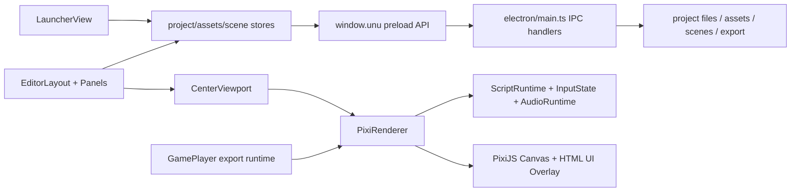

# 02. 代码结构与实现原理

## 总体架构

项目是“编辑器应用 + 轻量 ECS 引擎 + Electron 文件系统能力 + Web 导出运行时”的混合形态。当前实现重心放在功能闭环，边界还不够干净。

## 核心模型：ECS 风格

- `Component` 是抽象基类，只要求 `type`。
- `Entity` 保存 `id/name`、Prefab 来源、场景文件夹路径、父子层级，以及 `Map<string, Component>`。
- `Scene` 保存实体数组和类文件夹列表，并在实体层级变动时同步 `Transform.zIndex`。
- 组件类型包括：
  - `Transform`
  - `Sprite`
  - `Collider`
  - `Animation`
  - `Script`
  - `Camera`
  - `Background`
  - `Interactable`
  - `Audio`
  - `UI`
  - `Tilemap`

优点：模型简单，编辑器和运行时都容易读写。  
问题：类实例直接塞进 Pinia reactive state，触发 TypeScript 和 Vue proxy 的结构类型问题；`Scene` 里有 private 方法，导致 reactive 后的类型和原类不再兼容。

## 状态层：Pinia Store

当前 store 的职责如下：

- `project.ts`：当前工程、当前场景文件、状态消息、状态日志分类。
- `assets.ts`：资源树、资源选择、图片预览、文本草稿、文件级撤销重做、项目打开/创建/另存/导出。
- `scene.ts`：场景集合、当前场景、实体 CRUD、撤销重做、自动保存、Prefab、场景类文件夹、脚本同步。
- `runtime.ts`：播放/暂停、加载态、FPS 和阶段性能指标。
- `editor.ts`：工具选择、面板 tab、窗口尺寸、错误定位。
- `console.ts`：Console 消息队列。
- `selection.ts`：当前实体选择。

主要问题：store 不只是“状态容器”，还承担大量业务服务和文件系统编排。尤其 `assets.ts` 直接调用 `window.unu` 近 49 处，`scene.ts` 也把序列化、Prefab、工程状态写在一起。

## 渲染与编辑交互

`PixiRenderer` 是当前渲染中心：

- 初始化 Pixi `Application`、Canvas、world/ui/overlay/backdrop 容器。
- 维护纹理缓存、实体节点缓存、HTML UI DOM overlay 缓存。
- 渲染 `Sprite`、`Tilemap`、`UI`、`Background` 和调试元素。
- 处理选择、移动、缩放、平移、滚轮缩放、Gizmo 绘制。
- 播放态时复制场景、刷新项目脚本、驱动脚本/输入/音频/动画。
- 直接读取 `project/assets/scene/editor/runtime` stores，并写状态消息。

实现亮点：节点缓存和 render queue 有意识地避免重复渲染；HTML UI overlay 能支持更复杂的 UI。  
架构问题：Renderer 同时是渲染器、控制器、运行态协调器和应用服务消费者，拆分收益很高。

## 运行时与项目脚本

运行时由三个模块组成：

- `ScriptRuntime`：加载项目脚本、合并内置脚本和项目脚本、调用生命周期 hook、处理碰撞事件、提供 `ctx.api`。
- `InputState`：键鼠状态、动作映射、用户改键、本地存储、项目输入 runtime 覆盖。
- `AudioRuntime`：实体音频和一次性音效、音量分组、项目音频 runtime 覆盖。

项目脚本加载方式：

1. 通过 Electron 读取 `assets/scripts/*.js|*.ts`。
2. 用 `typescript.transpileModule` 转成 CommonJS。
3. 通过 `new Function('module', 'exports', ...)` 执行。
4. 读取 `default` 或 `module.exports`，形成 script hooks。

这让用户脚本很灵活，但也带来两个问题：

- 安全边界弱：当前是直接执行项目代码，不是真 sandbox。
- 职责混杂：`ScriptRuntime.ts` 内还保留了大量 sample-specific 内置玩法，例如 player、enemy、bullet、patrol 等逻辑。

## Electron 边界

`preload.ts` 暴露 `window.unu`，包含项目、资源、场景、Prefab、文本文件、脚本监听、导出、子窗口等 API。  
`main.ts` 注册对应 IPC handler，并实现：

- 工程创建、打开、另存、重命名、删除。
- 资源导入、读取、复制、移动、重命名、删除、恢复。
- 场景/Prefab/文本资源保存与打开。
- 样例工程复制和缺失资产修复。
- 资源引用扫描、路径规范化、重定向。
- Web 游戏导出、导出启动脚本生成。
- 主窗口 preset、Tilemap 子窗口、Code Editor 子窗口。

当前最大问题是 `main.ts` 既是 IPC 注册表，又是文件系统服务，又是样例种子生成器，又是导出器。后续应按领域拆成 `electron/services/*` 和 `electron/ipc/*`。

## 序列化与资源

- Scene JSON 格式：`format: "unu-scene"`，`version: 1`，包含 `scene.id/name/entities/sceneFolders`。
- Prefab JSON 格式：`format: "unu-prefab"`，`version: 2`，支持 `variantOf`。
- Animation/Atlas JSON 使用 `.anim.json`、`.atlas.json`。
- 资源类型由扩展名和后缀推断：image/audio/script/scene/prefab/animation/atlas。

现状风险：序列化逻辑集中在 switch-case，组件字段变多后维护压力上升。建议后续引入组件 schema/adapter，每个组件自己提供 `serialize/deserialize/normalize`。

## 依赖关系观察

静态 import 未发现直接循环依赖，这是一个好信号。  
但 fan-in/fan-out 显示依赖中心过于集中：

- 被引用最多：`scene.ts` 18 次、`project.ts` 17 次、`editor.ts` 17 次、`assets.ts` 14 次、`runtime.ts` 13 次。
- 外连最多：`PixiRenderer.ts` 23 个本地依赖、`scene.ts` 19 个、`InspectorPanel.vue` 17 个。

这意味着后续重构时不要从边缘组件开始“精装修”，而要先给这些中心模块加接口层和测试护栏。

